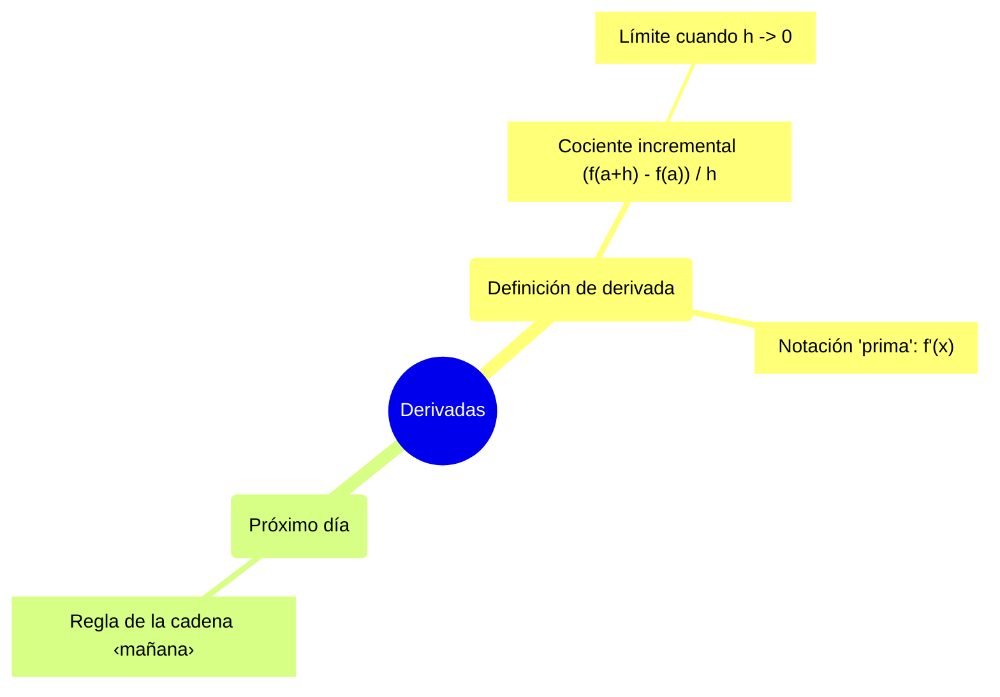

# Esquema: Derivadas

## 1. Definición de derivada

El límite del cociente incremental · Apuntes: [#definicion](../notes/apuntes.md#definicion)

- **1.1 Cociente incremental (f(a+h) - f(a)) / h** · [#definicion](../notes/apuntes.md#definicion)
  - **1.1.1 Límite cuando h -> 0**: Existe si la función es derivable en a · [#definicion](../notes/apuntes.md#definicion)
- **1.2 Notación "prima": f'(x)**: La que se usa en clase · [#definicion](../notes/apuntes.md#definicion)

## 2. Próximo día

Apuntes: [#proximo-dia](../notes/apuntes.md#proximo-dia)

- **2.1 Regla de la cadena &lt;mañana>**: Se verá en la próxima clase · [#proximo-dia](../notes/apuntes.md#proximo-dia), [#definicion](../notes/apuntes.md#definicion)

## Mapa mental

