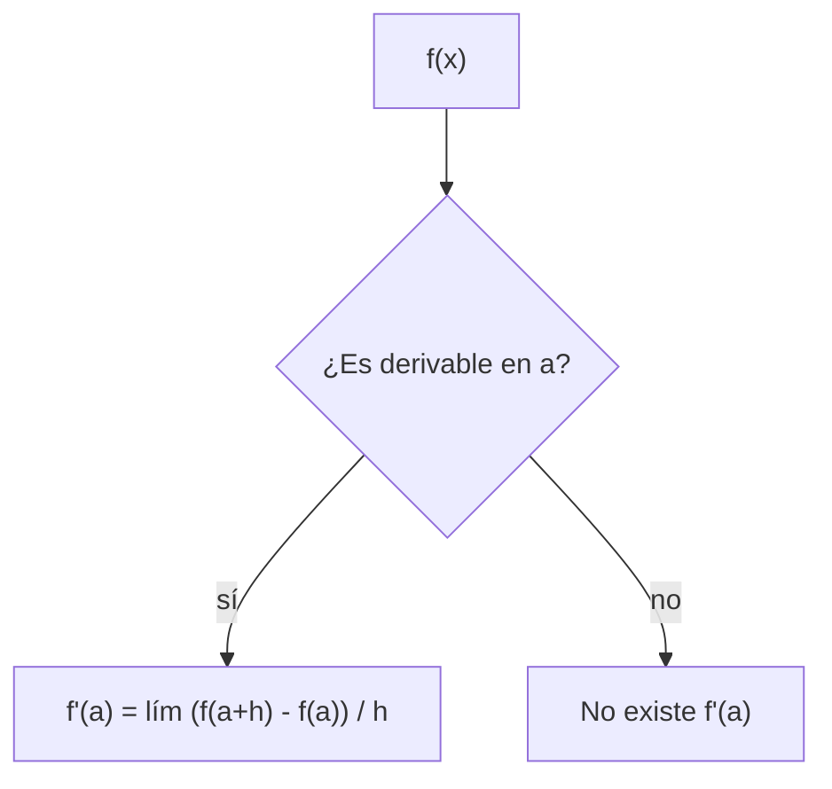

Sigue el esquema de la clase:

```mermaid
flowchart TD
  A["f(x)"] --> B{"¿Es derivable en a?"}
  B -->|sí| C["f'(a) = lím (f(a+h) - f(a)) / h"]
  B -->|no| D["No existe f'(a)"]
```

Explica cada paso.
