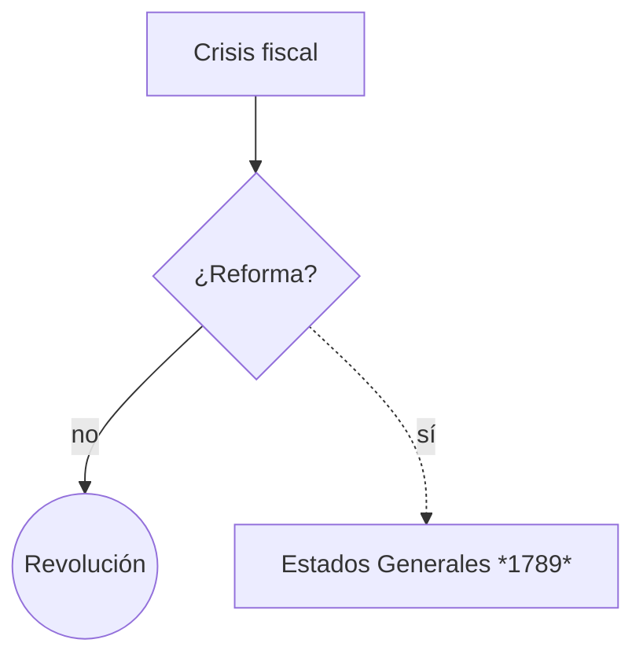

# Diagrama

## Esquema {#esquema}

El esquema del cuaderno resume las causas.[^p1]

```mermaid
graph TD
  A[Crisis fiscal] --> B{¿Reforma?}
  B -->|no| C((Revolución))
  B -.->|sí| D["Estados Generales *1789*"]
```

Texto después del diagrama.

[^p1]: [Apuntes, página 1](../sources/notes/page-001.jpg)
